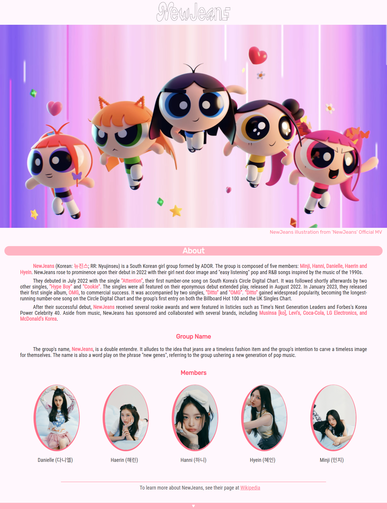

# NewJeans Tribute Page

 
 

**Certification Project**

Project for _freeCodeCamp_ **Responsive Web Design** course

A tribute page for the kpop group NewJeans using HTML and CSS.

## Objective

The objective of this project was to make an app similar to "https://tribute-page.freecodecamp.rocks" for a subject of my choosing and passing the test's requirements, practicing what was learned on the second module of the course, like the **CSS Box Model**, **Flexbox** and **Typography**.

### **Acknowledgments**

I've got the stickers images from the https://girlsprintinghouse.com/ website and just removed the background on GIMP.

### **Troubleshooting and considerations**

- I tried to position the stickers on the members div with "position: absolute" and top and left properties, but then it didn't followed the hover effect present in the div it should be attached on, instead it would end up in some random parts of the screen.

  - **Solution:** Used the "transform: translate();" property to position the stickers properly.
  - **Reminder for the next project:** Try out more functions in the transform property.

- I've manually positioned the elements within the members container in the HTML file, element by element, and then figure out i could've done this just by changing the flex-direction property in the CSS.

  - **Solution:** I actually left it as it was
  - **Reminder for the next project:** Do it the quicker way next time

 

_
Project's screenshot
_
